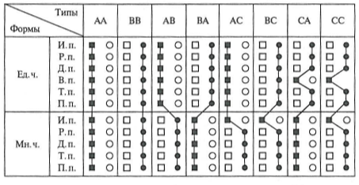

% Morfologia, luento 5
% Juho Härme
% Pinni B 5004, juho.harme@uta.fi

# Sija kieliopillisena kategoriana

<!--  pandoc -f markdown -s luento5.Rmd -t slideous -o luento5.html --self-contained --include-in-header=fontheader.html --smart -->

# Muutoksia vartaloissa

<!-- Mikä ilmiö? Järjestyksessä samalla kertaillaan muotoja... -->

<article class='incremental' style='float:left;'>

<table style="visibility: visible;">
<thead>
<tr class="header">
<th align="left">Sija</th>
<th align="left">Päätemorfi</th>
<th align="left">esim.</th>
</tr>
</thead>
<tbody>
<tr class="odd incremental">
<td align="left">y.nom.</td>
<td align="left">ø</td>
<td align="left">сон</td>
</tr>
<tr class="even incremental">
<td align="left">y.gen.</td>
<td align="left">/а/</td>
<td align="left">сна</td>
</tr>
<tr class="odd incremental">
<td align="left">y.akk.</td>
<td align="left">/ø/ ~ /a/</td>
<td align="left">сон</td>
</tr>
<tr class="even incremental">
<td align="left">y.dat.</td>
<td align="left">/у/</td>
<td align="left">сну</td>
</tr>
<tr class="odd incremental">
<td align="left">y.instr.</td>
<td align="left">/ом/</td>
<td align="left">cном</td>
</tr>
<tr class="even incremental">
<td align="left">y.prep.</td>
<td align="left">/е/ ~ /и</td>
<td align="left">сне</td>
</tr>
<tr class="odd incremental">
<td align="left">——-</td>
<td align="left">———</td>
<td align="left">—</td>
</tr>
<tr class="even incremental">
<td align="left">m.nom.</td>
<td align="left">/и/</td>
<td align="left">сны</td>
</tr>
<tr class="odd incremental">
<td align="left">m.gen.</td>
<td align="left">/ов/</td>
<td align="left">снов</td>
</tr>
<tr class="even incremental">
<td align="left">m.akk.</td>
<td align="left">/и/</td>
<td align="left">сны</td>
</tr>
<tr class="odd incremental">
<td align="left">m.dat.</td>
<td align="left">/ам/</td>
<td align="left">снам</td>
</tr>
<tr class="even incremental">
<td align="left">m.instr.</td>
<td align="left">/ами/</td>
<td align="left">cнами</td>
</tr>
<tr class="odd incremental">
<td align="left">m.prep.</td>
<td align="left">/ах/</td>
<td align="left">снах</td>
</tr>
</tbody>
</table>
</article>

<article class='incremental' style='float:left;margin-left:2em;padding:0.4em;background:beige;'>

### Väistyvä vokaali / Беглый гласный

>- Nyrkkisääntö: 
    - ennen nollapäätettä konkreettisena vokaalina (о,е,и)
    - muuten nollaäänne
>- Yksitavuisia, kaksitavuisia, useampitavuisia...

</article>

# Esimerkkejä

<article class='incremental' style='font-size:130%;'>

>- [рот](https://ru.wiktionary.org/wiki/рот),
  [сон](https://ru.wiktionary.org/wiki/сон),
  [ров](https://ru.wiktionary.org/wiki/ров),
  [рожь](https://ru.wiktionary.org/wiki/рожь),
  [лоб](https://ru.wiktionary.org/wiki/лоб),
  [мох](https://ru.wiktionary.org/wiki/мох),
  [лед](https://ru.wiktionary.org/wiki/лед),
  [шов](https://ru.wiktionary.org/wiki/шов),
  [день](https://ru.wiktionary.org/wiki/день),
  [лев](https://ru.wiktionary.org/wiki/лев),
  [пень](https://ru.wiktionary.org/wiki/пень)
>- [посол](https://ru.wiktionary.org/wiki/посол),
  [орёл](https://ru.wiktionary.org/wiki/орёл),
  [пепел](https://ru.wiktionary.org/wiki/пепел),
  [котёл](https://ru.wiktionary.org/wiki/котёл)
>- [висок](https://ru.wiktionary.org/wiki/висок),
  [дружок](https://ru.wiktionary.org/wiki/дружок),
>- [локоть](https://ru.wiktionary.org/wiki/локоть),
  [ноготь](https://ru.wiktionary.org/wiki/ноготь),
>- [огонь](https://ru.wiktionary.org/wiki/огонь),
  [корень](https://ru.wiktionary.org/wiki/корень),
>- [любимец](https://ru.wiktionary.org/wiki/любимец),
  [перец](https://ru.wiktionary.org/wiki/перец),
>- [воробей](https://ru.wiktionary.org/wiki/воробей),
  [муравей](https://ru.wiktionary.org/wiki/муравей),
  [ручей](https://ru.wiktionary.org/wiki/ручей)
>- [статья](https://ru.wiktionary.org/wiki/статья)

>- [Tehtävä](../tehtavat/luento5.pdf)

</article>

# Muita äänteenmuutostapauksia / yksittäisiä sanoja

>- Ухо - уши,ушей...
>- Око - очи, очей...
>- сосед - соседи, соседей...
>- Мать, дочь - ?
>- Мечта - ?
>- [судно](https://ru.wiktionary.org/wiki/судно)
>- [курица](https://ru.wiktionary.org/wiki/курица)
>- полдень, полбутылка, полчас...
>- путь: sekadeklinaatio

<article class='incremental'>

Sija   | Päätemorfi | esim 1.
----   | ---------- | ----  
Nom.   | /ø/        | путь 
Gen.   | /и/        | пути  
Akk.   | /ø/        | путь  
Dat.   | /и/        | пути  
Instr. | /ом/       | путём 
Prep.  | /и/        | пути  

</article>

>- [Tehtävä](../tehtavat/luento5.pdf)

# Vielä monikosta

<!-- Ensin tehdään edellä oleva tehtävä -->

>- Tietyillä 1. deklinaation substantiiveilla monikon nominatiivi: /а/
>- [бок](https://ru.wiktionary.org/wiki/бок), [век](https://ru.wiktionary.org/wiki/век), [глаз](https://ru.wiktionary.org/wiki/глаз), [дом](https://ru.wiktionary.org/wiki/дом), [адрес](https://ru.wiktionary.org/wiki/адрес), [берег](https://ru.wiktionary.org/wiki/берег), [вечер](https://ru.wiktionary.org/wiki/вечер), [лагерь](https://ru.wiktionary.org/wiki/лагерь), [паспорт](https://ru.wiktionary.org/wiki/паспорт), [профессор](https://ru.wiktionary.org/wiki/профессор)
>- Образ, лист, пропуск, цвет?

# Painotyypeistä

<article class='incremental nobul' style='max-width:40em;font-size:120%;'>
>- *Морфологическая характеристика имен существительных в русском языке не
ограничивается указанием всех падежных окончаний. Чтобы правильно пользоваться
словом, необходимо усвоить его акцентологические особенности.* 
(А.В. Исаченко)
>- Työlästä, mutta palkitsevaa!
>- Vartalo / pääte
>- Monikko / yksikkö
>- Nominatiivi / obliikvisijat
</article>

<article class='incremental nobul'>

</article>

# I deklinaatio

>1. [завОд](http://ru.wiktionary.org/wiki/завод)-tyyppi
>2. [стол](http://ru.wiktionary.org/wiki/стол)-tyyppi
>3. [нос](http://ru.wiktionary.org/wiki/нос)-tyyppi
>4. [волк](http://ru.wiktionary.org/wiki/волк)-tyyppi

# II deklinaatio

>1. [шкОла](http://ru.wiktionary.org/wiki/школа)-tyyppi
>2. Sanat, joilla yksikössä aina paino päätteellä
    - [трава](http://ru.wiktionary.org/wiki/трава)-tyyppi
    - [свеча](http://ru.wiktionary.org/wiki/свеча)-tyyppi
    - [волна](http://ru.wiktionary.org/wiki/волна)-tyyppi
>3. Sanat, joissa yksikön akkusatiivi muodostaa poikkeuksen
    - [рука](http://ru.wiktionary.org/wiki/рука)-tyyppi
    - [цена](http://ru.wiktionary.org/wiki/цена)-tyyppi

# III deklinaatio

>1. [Тетрадь](http://ru.wiktionary.org/wiki/тетрадь)-tyyppi
>2. [Вещь](http://ru.wiktionary.org/wiki/вещь)-tyyppi

# IV deklinaatio

>1. [богатство](http://ru.wiktionary.org/wiki/богатство)-tyyppi
>2. [слово](http://ru.wiktionary.org/wiki/слово)-tyyppi
>3. [письмо](http://ru.wiktionary.org/wiki/письмо)-tyyppi

<!-- TÄMÄN voi antaa rauhassa lipsahtaa seuraavan kerran puolelle. Joka tapauksessa itse opettelu kotiin! -->

